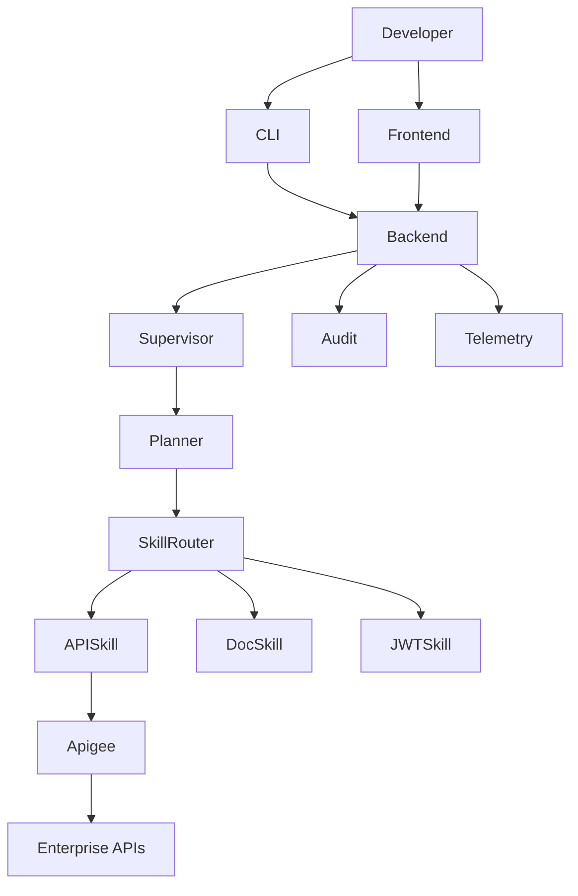

# Enterprise API Copilot

> **An Agentic AI Platform for Enterprise API Discovery, Testing, Troubleshooting and Automation.**

[](https://github.com/your-org/enterprise-api-copilot/actions/workflows/java-build.yml)
[](https://github.com/your-org/enterprise-api-copilot/actions/workflows/go-build.yml)
[](https://github.com/your-org/enterprise-api-copilot/actions/workflows/frontend-build.yml)
[](LICENSE)
[](https://opentelemetry.io/)
[](CONTRIBUTING.md)

---

## Project Vision

Enterprise API Copilot transforms how developers interact with enterprise APIs. Instead of navigating complex API portals, reading sprawling documentation, or manually composing curl commands, developers can simply describe what they want in plain language — and the platform does the rest.

**Example interaction:**

```
Developer: "Create a sandbox payment worth ₹500 for customer ID cust_abc123"

Copilot:
  ✓ Understanding your request...
  ✓ Planning execution steps...
  ✓ Discovering API: POST /v1/payments
  ✓ Authenticating via Apigee (OAuth 2.0)...
  ✓ Executing API...
  ✓ Response received (HTTP 201)

Payment created successfully!
  ID:     pay_9xK2mNpQ
  Amount: ₹500.00
  Status: authorized

Equivalent curl:
  curl -X POST https://api.example.com/v1/payments \
    -H "Authorization: Bearer <token>" \
    -d '{"amount": 500, "currency": "INR", "customer": "cust_abc123"}'
```

The platform supports agentic AI workflows, Apigee-backed authentication, multi-turn conversation, execution history, and SDK generation — making it a complete API productivity suite for enterprise engineering teams.

---

## Features

| Feature | Status |
|---|---|
| Natural language API discovery | 🚧 In Progress |
| Agentic planning and execution | 🚧 In Progress |
| Apigee OAuth 2.0 / JWT authentication | 🚧 In Progress |
| Multi-turn conversational interface | 🚧 In Progress |
| Execution history and replay | 🚧 In Progress |
| curl and SDK code generation | 🚧 In Progress |
| OpenAPI spec import and indexing | 🚧 In Progress |
| CLI (`copilot ask`, `copilot api`) | 🚧 In Progress |
| OpenTelemetry tracing | 🚧 In Progress |
| Kubernetes-native deployment | 🚧 In Progress |

---

## Architecture



### Key Design Principles

- **Hexagonal Architecture** — Domain logic is fully isolated from infrastructure concerns.
- **Domain-Driven Design** — Each bounded context owns its domain model.
- **Agent-Skill Separation** — Agents orchestrate; Skills execute. Skills are stateless MCP tools.
- **Backend as the Single Control Plane** — CLI and Frontend communicate only with the Backend; they never directly invoke agents or external systems.
- **Observability First** — OpenTelemetry is instrumented at every layer.

---

## Repository Structure

```
enterprise-api-copilot/
├── platform/
│   ├── auth/             # Identity and auth integrations
│   ├── gateway/          # API gateway controls
│   ├── config/           # Shared runtime configuration
│   ├── audit/            # Compliance and audit events
│   ├── telemetry/        # Tracing/metrics/log conventions
│   └── registry/         # Service and API registry assets
├── apps/
│   ├── backend/          # Spring Boot 3 backend (Java 21)
│   ├── frontend/         # React + TypeScript + Vite frontend
│   └── cli/              # Go CLI (Cobra + BubbleTea)
├── ai/
│   ├── supervisor/       # AI Supervisor runtime module
│   ├── planner/          # Execution planner runtime module
│   ├── memory/           # Conversation memory runtime module
│   └── reflection/       # Reflection and retry module
├── skills/
│   ├── api/              # API discovery/execution skill group
│   ├── docs/             # Documentation skill group
│   ├── jwt/              # JWT skill group
│   └── github/           # GitHub automation skill group
├── sdk/
│   ├── java/
│   ├── python/
│   ├── typescript/
│   └── go/
├── contracts/
│   ├── openapi/
│   ├── asyncapi/
│   └── json-schema/
├── observability/
│   ├── dashboards/
│   ├── otel/
│   ├── prometheus/
│   ├── grafana/
│   └── jaeger/
├── design/
│   ├── wireframes/
│   ├── sequence/
│   ├── component/
│   └── deployment/
├── apigee/               # Apigee proxy configuration and policies
├── deployment/           # Kubernetes manifests and Helm charts
├── docker/               # Dockerfiles and compose files
├── docs/                 # Architecture, ADRs, spring board, standards
├── examples/             # Example requests and integration demos
└── .github/              # CI/CD workflows, issue templates
```

> Canonical runtime code now lives under `ai/` and grouped `skills/` domains. Legacy `agents/` and legacy skill folders remain as compatibility shims.

---

## Tech Stack

| Layer | Technology |
|---|---|
| Backend | Java 21, Spring Boot 3, Spring AI, Maven |
| Database | PostgreSQL 16, Redis 7 |
| AI / Agents | Python 3.12, LangGraph, OpenAI SDK, MCP |
| Vector Store | pgvector / Qdrant |
| CLI | Go 1.22, Cobra, BubbleTea |
| Frontend | React 18, TypeScript, Vite, TailwindCSS |
| API Gateway | Apigee X |
| Observability | OpenTelemetry, Prometheus, Grafana |
| Infrastructure | Docker, Kubernetes, Helm, GitHub Actions |
| Code Quality | Checkstyle, Spotless, ESLint, Prettier, golangci-lint |

---

## Quick Start

### Prerequisites

- Java 21+
- Go 1.22+
- Node.js 20+
- Python 3.12+
- Docker & Docker Compose
- `OPENAI_API_KEY` environment variable

### Run with Docker Compose

```bash
git clone https://github.com/your-org/enterprise-api-copilot.git
cd enterprise-api-copilot

# Copy environment template
cp .env.example .env
# Edit .env with your credentials

# Start all services
docker compose -f docker/docker-compose.yml up -d

# Backend API:  http://localhost:8080
# Frontend:     http://localhost:3000
# API Docs:     http://localhost:8080/swagger-ui.html
```

### Run Backend Locally

```bash
cd apps/backend
./mvnw spring-boot:run -Dspring-boot.run.profiles=local
```

### Run Frontend Locally

```bash
cd apps/frontend
npm install
npm run dev
```

### Install CLI

```bash
cd apps/cli
go install ./cmd/copilot

# Verify installation
copilot version
copilot doctor
```

### First Interaction

```bash
# Login
copilot login --env sandbox

# Ask a question
copilot ask "List all available payment APIs"

# Execute an API
copilot api run --natural "Create a ₹500 sandbox payment"
```

---

## Spring Board

See [docs/spring-board.md](docs/spring-board.md) for milestone planning.

| Milestone | Focus |
|---|---|
| Milestone 1 | Foundation |
| Milestone 2 | Backend |
| Milestone 3 | CLI |
| Milestone 4 | AI |
| Milestone 5 | Skills |

Version milestones are tracked in [docs/milestones.md](docs/milestones.md).

---

## Developer Experience

See [docs/developer-experience.md](docs/developer-experience.md) for:

- Architecture references
- Coding standards
- Development workflow
- Branching strategy
- Commit convention
- Release strategy

---

## Contributing

We welcome contributions from the community. Please read [CONTRIBUTING.md](CONTRIBUTING.md) and [docs/coding-standards.md](docs/coding-standards.md) before opening a pull request.

### Good First Issues

Look for issues tagged [`good first issue`](https://github.com/your-org/enterprise-api-copilot/issues?q=label%3A%22good+first+issue%22) to get started.

---

## Security

Please review our [SECURITY.md](SECURITY.md) before reporting vulnerabilities. Do **not** open public GitHub issues for security bugs.

---

## License

Copyright 2026 Enterprise API Copilot Authors.

Licensed under the [Apache License, Version 2.0](LICENSE).
