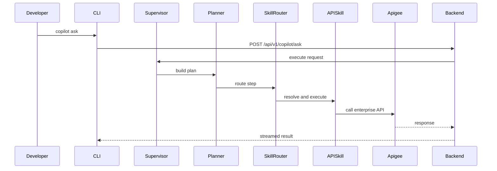

# Sequence Diagrams

Use Mermaid sequence diagrams for interactions.

```mermaid
sequenceDiagram
    participant Developer
    participant CLI
    participant Supervisor
    participant Planner
    participant SkillRouter
    participant APISkill
    participant Apigee
    participant Backend

    Developer->>CLI: copilot ask
    CLI->>Backend: POST /api/v1/copilot/ask
    Backend->>Supervisor: execute request
    Supervisor->>Planner: build plan
    Planner->>SkillRouter: route step
    SkillRouter->>APISkill: resolve and execute
    APISkill->>Apigee: call enterprise API
    Apigee-->>Backend: response
    Backend-->>CLI: streamed result
```
