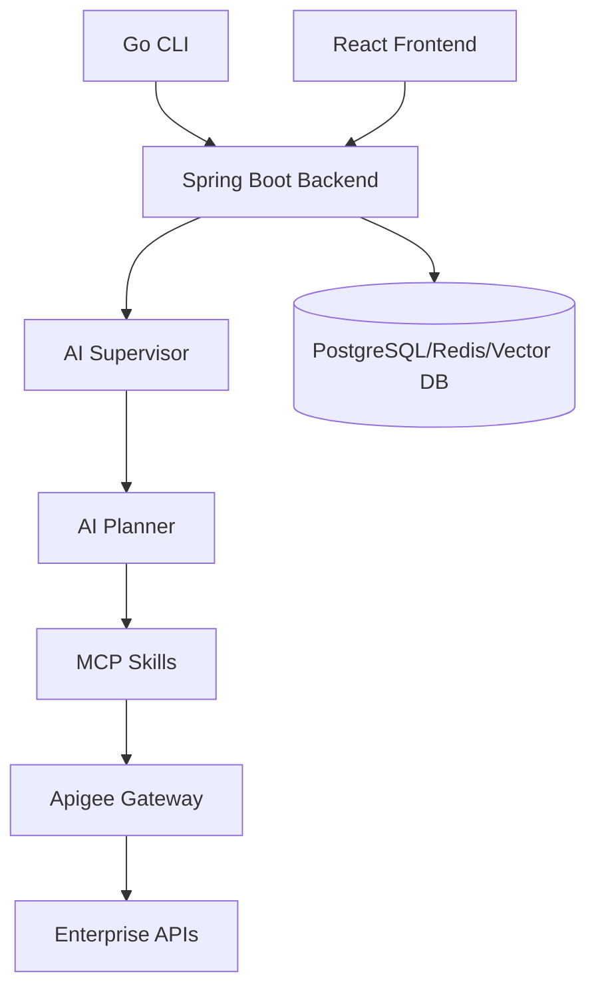
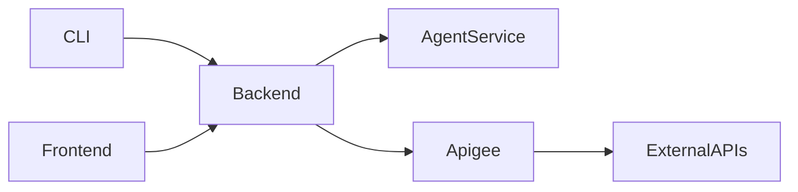
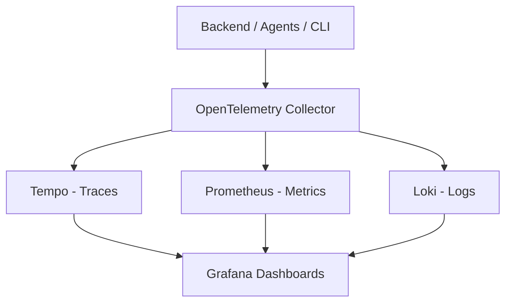

# Architecture

> Enterprise API Copilot — System Architecture Reference

**Version**: 0.1  
**Status**: Draft  
**Last Updated**: August 2026

---

## Table of Contents

1. [System Overview](#1-system-overview)
2. [Architectural Principles](#2-architectural-principles)
3. [Component Architecture](#3-component-architecture)
4. [Data Flow](#4-data-flow)
5. [Agent Architecture](#5-agent-architecture)
6. [Skill Architecture (MCP)](#6-skill-architecture-mcp)
7. [Security Architecture](#7-security-architecture)
8. [Observability Architecture](#8-observability-architecture)
9. [Deployment Architecture](#9-deployment-architecture)
10. [Technology Decisions](#10-technology-decisions)

---

## 1. System Overview

Enterprise API Copilot is a multi-layer platform consisting of:

| Layer | Component | Responsibility |
|---|---|---|
| Presentation | React Frontend / Go CLI | User interaction |
| API | Spring Boot Backend | Request orchestration, auth, persistence |
| Intelligence | LangGraph Agents | AI planning and execution |
| Execution | MCP Skills | Stateless tool invocation |
| Integration | Apigee / External APIs | Enterprise system connectivity |
| Storage | PostgreSQL + Redis + Vector DB | Data persistence |



---

## 2. Architectural Principles

### 2.1 Hexagonal Architecture (Ports and Adapters)

The backend follows hexagonal architecture. The domain model has no dependency on frameworks, databases, or external services.

```
                    ┌──────────────────────────────┐
                    │        Domain Core            │
                    │  (Entities, Domain Services,  │
                    │   Use Cases, Ports)           │
                    └──────────────┬───────────────┘
                                   │
              ┌────────────────────┼────────────────────┐
              ▼                    ▼                     ▼
    ┌──────────────────┐ ┌──────────────────┐ ┌──────────────────┐
    │  Inbound Adapters│ │ Outbound Adapters│ │  Config Adapters │
    │  (REST, gRPC,    │ │  (JPA, Redis,    │ │  (Spring, OTEL)  │
    │   WebSocket)     │ │   HTTP Clients)  │ │                  │
    └──────────────────┘ └──────────────────┘ └──────────────────┘
```

### 2.2 Domain-Driven Design

Bounded contexts:

- **Conversation** — Chat sessions, message history, turn management
- **Execution** — API call execution, request/response lifecycle
- **Catalog** — API discovery, OpenAPI spec indexing
- **Identity** — Authentication, authorization, token management
- **Telemetry** — Traces, metrics, audit logs

### 2.3 Backend as Single Control Plane

Neither the CLI nor the Frontend communicate directly with AI agents or external APIs. All traffic routes through the Backend, which enforces authentication, authorization, rate limiting, and audit logging.



---

## 3. Component Architecture

### 3.1 Backend (Spring Boot 3)

```
apps/backend/src/main/java/io/enterprise/copilot/
├── application/
│   ├── port/
│   │   ├── inbound/          # Use case interfaces
│   │   └── outbound/         # Repository and gateway interfaces
│   └── usecase/              # Use case implementations
├── domain/
│   ├── conversation/         # Conversation aggregate
│   ├── execution/            # Execution aggregate
│   ├── catalog/              # API catalog aggregate
│   └── identity/             # Identity aggregate
├── infrastructure/
│   ├── adapter/
│   │   ├── inbound/
│   │   │   ├── rest/         # REST controllers
│   │   │   └── websocket/    # WebSocket handlers
│   │   └── outbound/
│   │       ├── persistence/  # JPA repositories
│   │       ├── cache/        # Redis adapters
│   │       ├── agent/        # Agent HTTP client
│   │       └── apigee/       # Apigee client
│   └── config/               # Spring configuration
└── CopilotApplication.java
```

### 3.2 Frontend (React + TypeScript)

```
apps/frontend/src/
├── pages/
│   ├── Dashboard/
│   ├── Chat/
│   ├── History/
│   └── Architecture/
├── components/              # Reusable UI components
├── hooks/                   # Custom React hooks
├── services/                # API client layer
├── store/                   # State management
├── types/                   # TypeScript type definitions
└── utils/                   # Utilities
```

### 3.3 CLI (Go + Cobra)

```
apps/cli/
├── cmd/
│   └── copilot/
│       └── main.go          # Entry point
├── internal/
│   ├── commands/            # Command implementations
│   ├── api/                 # Backend API client
│   ├── config/              # CLI configuration
│   ├── auth/                # Token storage
│   └── tui/                 # BubbleTea TUI components
└── pkg/
    └── output/              # Output formatters
```

---

## 4. Data Flow

### 4.1 Natural Language API Execution Flow

```
User Input (CLI/UI)
       │
       ▼
Backend: POST /api/v1/copilot/ask
       │  Validate JWT, Rate Limit, Log
       ▼
Agent Service: /execute
       │
       ▼
Supervisor Agent (LangGraph)
       │
       ├─► Planner Agent
       │        │
       │        ▼
       │   Execution Plan (steps[])
       │
       └─► For each step:
                │
                ├─► MCP Skill: api.discovery    →  Find matching API
                ├─► MCP Skill: jwt             →  Get auth token
                ├─► MCP Skill: api.executor     →  Execute API call
                └─► MCP Skill: api.sdk_generator →  Generate curl/SDK
       │
       ▼
Backend: Stream response back (SSE)
       │
       ▼
Frontend/CLI: Display result with curl equivalent
```

---

## 5. Agent Architecture

### 5.1 LangGraph State Machine

```
START
  │
  ▼
[supervisor]  ─── cannot_handle ──►  [END: unsupported]
  │
  │ route
  ▼
[planner]  ─── planning_failed ──►  [reflection] ──► [planner]
  │
  │ plan_ready
  ▼
[executor]
  │  (loop over plan steps)
  ├─ step_failed ──► [reflection] ──► [executor]
  │
  │ all_steps_done
  ▼
[memory_writer]
  │
  ▼
[response_formatter]
  │
  ▼
END
```

### 5.2 Agent Responsibilities

| Agent | Responsibility |
|---|---|
| **Supervisor** | Classify intent, decide routing, maintain conversation context |
| **Planner** | Break user request into ordered execution steps |
| **Executor** | Invoke MCP skills for each step |
| **Reflection** | Analyze failures, replan or retry |
| **Memory** | Persist relevant context for future turns |

---

## 6. Skill Architecture (MCP)

Skills are **stateless MCP tools** invoked by agents. They handle a single responsibility and communicate with external systems.

| Skill | Input | Output |
|---|---|---|
| `api.discovery` | Natural language query | Ranked list of matching APIs |
| `api.executor` | API spec + parameters + token | HTTP response |
| `jwt` | Client credentials | Signed JWT |
| `api.sdk_generator` | API request details | curl + SDK code |
| `documentation` | API spec | Generated markdown docs |

---

## 7. Security Architecture

See [security.md](security.md) for detailed security design.

Key controls:

- All external access via Apigee (OAuth 2.0)
- Backend validates JWT on every request
- Agent service is internal only (not exposed externally)
- Secrets via Kubernetes Secrets / Vault
- TLS everywhere (mTLS for internal services in production)

---

## 8. Observability Architecture



Every request carries a `trace-id` from ingress to storage.

---

## 9. Deployment Architecture

See `deployment/` for Helm charts and Kubernetes manifests.

```
Kubernetes Cluster
├── namespace: api-copilot-system
│   ├── Deployment: backend          (3 replicas)
│   ├── Deployment: agent-service    (2 replicas)
│   ├── Deployment: frontend         (2 replicas)
│   ├── Service: backend-svc
│   ├── Service: agent-svc (ClusterIP only)
│   ├── Ingress: api-copilot-ingress
│   └── HPA: backend, agent-service
├── namespace: api-copilot-data
│   ├── StatefulSet: postgresql
│   ├── StatefulSet: redis
│   └── StatefulSet: qdrant
└── namespace: api-copilot-monitoring
    ├── Deployment: otel-collector
    ├── Deployment: grafana
    └── Deployment: prometheus
```

---

## 10. Technology Decisions

See [adr/](adr/) for detailed Architecture Decision Records.

| Decision | Choice | Rationale |
|---|---|---|
| AI Orchestration | LangGraph | Stateful graph execution, human-in-loop, streaming |
| API Framework | Spring Boot 3 | Enterprise maturity, Spring AI, virtual threads (Loom) |
| CLI | Go + Cobra | Fast binary, single executable, rich TUI ecosystem |
| Tool Protocol | MCP | Standardized AI tool interface, composable skills |
| API Gateway | Apigee | Enterprise OAuth, quota management, analytics |
