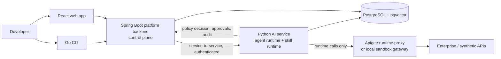

# Architecture Overview

> Status markers: **Implemented** = code + tests in this repository; **Planned** = designed,
> not yet built; **Blocked** = designed, cannot be built/verified in the current environment
> (see `docs/implementation/STATUS.md`).

## System context



## Service boundaries

| Service | Owns | Does not own | Status |
|---|---|---|---|
| **Go CLI** (`apps/cli`) | Developer commands, local config, token storage, output formatting | Any business logic; never calls the AI service or gateways directly | Scaffold; Blocked (module downloads) |
| **React app** (`apps/frontend`) | Chat/workflow UI, API explorer, approvals queue, run history, eval dashboard | Fabricated data — unavailable features are labelled | Scaffold; Blocked (npm) |
| **Spring Boot platform** (`apps/backend`) | Identity, tenant/role context, **policy decisions**, API & skill registry metadata, run lifecycle, approval records, audit events, platform config, health | Model calls, retrieval, planning | Scaffold; Blocked (Maven Central) |
| **Python AI service** (`ai/`, `skills/`) | Intent classification, planning, bounded execution, skill runtime (**policy enforcement point**), retrieval, model routing, evaluation instrumentation | Final authorization decisions, approval records of record | Core implemented; HTTP/LangGraph adapters Planned |
| **Sandbox gateway** (`sandbox/`) | Synthetic Payments API with OAuth2 client-credentials, scopes, idempotency, tenant isolation and fault injection | Anything real | Implemented |
| **Evaluation** (`evals/`) | Versioned datasets, deterministic evaluators, runner, reports | Production traffic | Implemented (offline) |

## Canonical code layout (Python)

```
ai/
  agent/        intent classification, planner, bounded orchestrator, typed run state
  knowledge/    document model + stable IDs, OpenAPI/Markdown ingestion, BM25,
                hashing embedder, RRF hybrid retrieval, context assembly, grounded answers
  models/       ModelProvider interface, deterministic offline provider, usage accounting
  telemetry.py  span/attribute helpers (gen_ai.* names in one place)
skills/
  runtime/      skill contracts, registry, policy (PEP + local PDP), approvals,
                idempotency, audit, outbound HTTP safety, redaction, runtime
  api/          discovery, describe, execute (via gateway adapter), sdk_generator
  jwt/          token inspection (no verification claims, no secret echo)
  docs/         documentation search with citations
  builtin.py    registers built-in skills
  mcp_server.py MCP adapter — every tool call goes through the runtime
sandbox/        synthetic gateway app, OpenAPI spec, synthetic docs
evals/          datasets/, evaluators, metrics, runner, reports
tests/          unit/ and integration/ suites
```

Legacy trees `agents/` and the hyphenated `skills/*-*` directories were removed
(ADR-0005); they had no callers outside the Makefile and CI.

## Request flow (target)

1. CLI/web → platform `POST /api/v1/runs` with user identity.
2. Platform resolves tenant and roles, creates a run record, calls the AI service with a
   signed service token and the principal context.
3. AI service: classify intent → build bounded plan → for each step call the **skill
   runtime**, which validates input, asks the policy decision point, checks approval and
   idempotency, executes with timeouts, validates output, emits audit and telemetry.
4. Side-effecting steps without a valid approval stop the run in `AWAITING_APPROVAL`; the
   platform records the approval request; a human approves the *exact* action hash; the
   run resumes.
5. Results, citations, cURL equivalent and evidence return to the platform, which
   persists the run and audit trail.

In this session the platform side is replaced by documented local adapters
(`LocalPolicyEngine`, `InMemoryApprovalStore`) behind the same interfaces, because the
Java backend cannot be built in the current environment. These are dev/test
implementations, not production substitutes.

## Data ownership

- `platform` schema — Flyway migrations in `apps/backend` (runs, approvals, audit, registry).
- `knowledge` schema — owned by the AI service (`ai/knowledge/sql/`): documents, chunks,
  embeddings, full-text vectors.
- No service reads another service's schema directly (ADR-0007).
